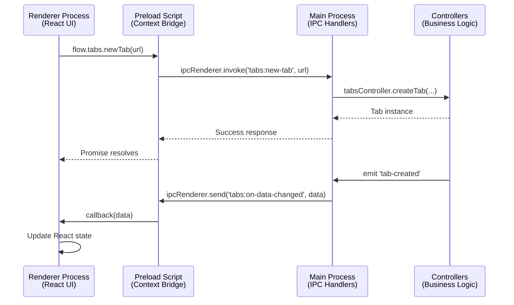

Flow Browser uses **Electron's IPC** (Inter-Process Communication) system for communication between the main process (Node.js) and renderer processes (React UI).

## IPC Architecture



## Three-Layer System

### Layer 1: Renderer (React Components)

React components call the Flow API:

```tsx
// Renderer process - React component
function TabControls() {
  const handleNewTab = async () => {
    // Call Flow API exposed by preload
    await flow.tabs.newTab('https://example.com');
  };
  
  return <button onClick={handleNewTab}>New Tab</button>;
}
```

### Layer 2: Preload (Context Bridge)

**File**: `src/preload/index.ts:410`

Preload exposes the Flow API via `contextBridge`:

```typescript
// Preload script
import { contextBridge, ipcRenderer } from 'electron';

const tabsAPI: FlowTabsAPI = {
  newTab: async (url?: string, isForeground?: boolean, spaceId?: string) => {
    return ipcRenderer.invoke('tabs:new-tab', url, isForeground, spaceId);
  },
  
  onDataUpdated: (callback: (data: WindowTabsData) => void) => {
    return listenOnIPCChannel('tabs:on-data-changed', callback);
  },
  
  closeTab: async (tabId: number) => {
    return ipcRenderer.invoke('tabs:close-tab', tabId);
  }
};

// Expose to renderer
contextBridge.exposeInMainWorld('flow', {
  tabs: wrapAPI(tabsAPI, 'browser'),
  // ... other APIs
});
```

<Note>
**Security**: The preload script runs in an isolated context and carefully controls which APIs are exposed. Only explicitly defined methods are available to the renderer.
</Note>

### Layer 3: Main Process (IPC Handlers)

**File**: `src/main/ipc/browser/tabs.ts:1`

Main process registers IPC handlers:

```typescript
// Main process IPC handlers
import { ipcMain } from 'electron';
import { tabsController } from '@/controllers/tabs-controller';

ipcMain.handle('tabs:new-tab', async (event, url?: string, isForeground?: boolean, spaceId?: string) => {
  const sender = event.sender;
  const window = windowsController.getWindowFromWebContents(sender);
  
  if (!window || window.type !== 'browser') {
    throw new Error('Invalid window context');
  }
  
  const tab = await tabsController.createTab(
    window.id,
    undefined, // Use default profile
    spaceId,
    undefined,
    { url, isForeground }
  );
  
  return tab.id;
});
```

## IPC Patterns

### Request/Response (invoke/handle)

For operations that return values:

<CodeGroup>
```typescript Renderer
// Async request with response
const tabId = await flow.tabs.newTab('https://example.com');
console.log('Created tab:', tabId);
```

```typescript Preload
const tabsAPI = {
  newTab: async (url?: string) => {
    return ipcRenderer.invoke('tabs:new-tab', url);
  }
};
```

```typescript Main
ipcMain.handle('tabs:new-tab', async (event, url?: string) => {
  const tab = await tabsController.createTab(...);
  return tab.id;
});
```
</CodeGroup>

### Fire-and-Forget (send)

For operations that don't need a response:

<CodeGroup>
```typescript Renderer
// No return value needed
flow.navigation.goTo('https://example.com', tabId);
```

```typescript Preload
const navigationAPI = {
  goTo: (url: string, tabId?: number) => {
    return ipcRenderer.send('navigation:go-to', url, tabId);
  }
};
```

```typescript Main
ipcMain.on('navigation:go-to', (event, url: string, tabId?: number) => {
  const tab = tabsController.getTabById(tabId);
  tab?.loadURL(url);
});
```
</CodeGroup>

### Event Subscriptions (on)

For receiving updates from main process:

<CodeGroup>
```typescript Renderer
// Subscribe to tab updates
useEffect(() => {
  const unsubscribe = flow.tabs.onDataUpdated((data) => {
    setTabsData(data);
  });
  
  return unsubscribe; // Cleanup
}, []);
```

```typescript Preload
function listenOnIPCChannel(channel: string, callback: (...args: any[]) => void) {
  const wrappedCallback = (_event: any, ...args: any[]) => {
    callback(...args);
  };
  
  const listenerId = generateUUID();
  ipcRenderer.send('listeners:add', channel, listenerId);
  ipcRenderer.on(channel, wrappedCallback);
  
  return () => {
    ipcRenderer.send('listeners:remove', channel, listenerId);
    ipcRenderer.removeListener(channel, wrappedCallback);
  };
}

const tabsAPI = {
  onDataUpdated: (callback: (data: WindowTabsData) => void) => {
    return listenOnIPCChannel('tabs:on-data-changed', callback);
  }
};
```

```typescript Main
// Send updates to renderer
export function windowTabsChanged(windowId: number) {
  const window = browserWindowsController.getWindowById(windowId);
  if (!window) return;
  
  const data = getWindowTabsData(window);
  window.browserWindow.webContents.send('tabs:on-data-changed', data);
}
```
</CodeGroup>

## IPC Channel Organization

**Directory**: `src/main/ipc/`

IPC handlers are organized by domain:

<Tabs>
  <Tab title="App">
    **Location**: `src/main/ipc/app/`
    
    Application-level handlers:
    - `app.ts` - App info, clipboard, default browser
    - `window-controls.ts` - Window minimize/maximize/close
    - `updates.ts` - Auto-update functionality
    - `shortcuts.ts` - Keyboard shortcut management
    - `extensions.ts` - Extension management
    - `new-tab.ts` - New tab creation
    - `icons.ts` - App icon management
    - `onboarding.ts` - Onboarding flow
    - `open-external.ts` - External link handling
    - `actions.ts` - App-wide actions
  </Tab>
  
  <Tab title="Browser">
    **Location**: `src/main/ipc/browser/`
    
    Browser functionality:
    - `browser.ts` - Browser window creation, profile loading
    - `tabs.ts` - Tab CRUD operations
    - `page.ts` - Page bounds and layout
    - `navigation.ts` - URL navigation, reload, history
    - `interface.ts` - UI component positioning
    - `find-in-page.ts` - Find in page functionality
  </Tab>
  
  <Tab title="Session">
    **Location**: `src/main/ipc/session/`
    
    Profile and workspace management:
    - `profiles.ts` - Profile CRUD operations
    - `spaces.ts` - Space (workspace) management
  </Tab>
  
  <Tab title="Window">
    **Location**: `src/main/ipc/window/`
    
    Window-specific:
    - `settings.ts` - Settings window IPC
    - `omnibox.ts` - Omnibox window IPC
  </Tab>
</Tabs>

## Type-Safe IPC

Flow Browser uses **shared TypeScript interfaces** for type safety across IPC boundaries.

### Interface Definitions

**Directory**: `src/shared/flow/interfaces/`

Each API domain has a typed interface:

```typescript
// src/shared/flow/interfaces/browser/tabs.ts
export interface FlowTabsAPI {
  getData(): Promise<WindowTabsData>;
  onDataUpdated(callback: (data: WindowTabsData) => void): () => void;
  onTabsContentUpdated(callback: (tabs: TabData[]) => void): () => void;
  
  switchToTab(tabId: number): Promise<void>;
  closeTab(tabId: number): Promise<void>;
  moveTab(tabId: number, newPosition: number): Promise<void>;
  
  newTab(url?: string, isForeground?: boolean, spaceId?: string): Promise<number>;
  
  getRecentlyClosed(): Promise<PersistedTabData[]>;
  restoreRecentlyClosed(uniqueId: string): Promise<void>;
}
```

### Shared Types

**Directory**: `src/shared/types/`

```typescript
// src/shared/types/tabs.ts
export interface TabData {
  id: number;
  uniqueId: string;
  profileId: string;
  spaceId: string;
  
  url: string;
  title: string;
  favicon: string | null;
  
  isLoading: boolean;
  canGoBack: boolean;
  canGoForward: boolean;
  
  visible: boolean;
  asleep: boolean;
  
  position: number;
  groupId: string | null;
}

export interface WindowTabsData {
  windowId: number;
  currentSpaceId: string;
  
  tabs: TabData[];
  tabGroups: TabGroupData[];
  
  activeTabIds: WindowActiveTabIds;
  focusedTabIds: WindowFocusedTabIds;
  
  profiles: string[];
  spaces: string[];
}
```

<Tip>
Shared types ensure that the data structure sent from main process matches what renderer expects - TypeScript catches mismatches at compile time.
</Tip>

## Permission System

The preload script implements a **permission system** to control API access.

**File**: `src/preload/index.ts:58`

```typescript
type Permission = 'all' | 'app' | 'browser' | 'session' | 'settings';

function hasPermission(permission: Permission): boolean {
  const isFlowProtocol = isProtocol('flow:');
  const isFlowInternalProtocol = isProtocol('flow-internal:');
  
  // Browser UI
  const isMainUI = isLocation('flow-internal:', 'main-ui');
  const isPopupUI = isLocation('flow-internal:', 'popup-ui');
  
  switch (permission) {
    case 'all':
      return true;
    case 'app':
      return isFlowInternalProtocol || isFlowProtocol;
    case 'browser':
      return isMainUI || isPopupUI;
    case 'session':
      return isFlowInternalProtocol;
    case 'settings':
      return isFlowInternalProtocol;
    default:
      return false;
  }
}
```

### API Wrapping

APIs are wrapped with permission checks:

```typescript
function wrapAPI<T>(api: T, permission: Permission, overrides?: {}) {
  const wrappedAPI = {} as T;
  
  for (const key in api) {
    const value = api[key];
    
    if (typeof value === 'function') {
      wrappedAPI[key] = (...args) => {
        const requiredPermission = overrides?.[key] || permission;
        
        if (!hasPermission(requiredPermission)) {
          throw new Error(`Permission denied: flow.${permission}.${key}()`);
        }
        
        return value(...args);
      };
    }
  }
  
  return wrappedAPI;
}

// Expose with permissions
const flowAPI = {
  tabs: wrapAPI(tabsAPI, 'browser', {
    newTab: 'app', // Special: newTab allowed for all internal pages
    disablePictureInPicture: 'all' // Special: allowed everywhere
  }),
  // ...
};
```

<Warning>
**Security Critical**: The permission system prevents arbitrary web pages from accessing browser APIs. Only Flow's internal pages (`flow:` and `flow-internal:` protocols) can call these APIs.
</Warning>

## Event Broadcasting

Main process controllers emit events that trigger IPC messages to all relevant windows.

### Broadcasting Pattern

```typescript
// Controller emits event
tabsController.on('tab-created', (tab) => {
  windowTabsChanged(tab.getWindow().id);
});

tabsController.on('tab-removed', (tab) => {
  windowTabsChanged(tab.getWindow().id);
});

// IPC handler broadcasts to window
export function windowTabsChanged(windowId: number) {
  const window = browserWindowsController.getWindowById(windowId);
  if (!window || quitController.isQuitting) return;
  
  const data = getWindowTabsData(window);
  
  // Send to main browser window
  window.browserWindow.webContents.send('tabs:on-data-changed', data);
  
  // Send to portal windows (omnibox, etc.)
  for (const portal of window.portalWindows.values()) {
    portal.webContents.send('tabs:on-data-changed', data);
  }
}
```

**File**: `src/main/ipc/browser/tabs.ts:189`

### Lightweight Updates

For frequent updates (URL changes, titles), use content-only updates:

```typescript
export function windowTabContentChanged(windowId: number, tabId: number) {
  const window = browserWindowsController.getWindowById(windowId);
  if (!window || quitController.isQuitting) return;
  
  const tab = tabsController.getTabById(tabId);
  if (!tab) return;
  
  const managers = tabsController.getTabManagers(tabId);
  const tabData = serializeTabForRenderer(tab, managers?.lifecycle.preSleepState);
  
  // Only send the changed tab, not all tabs
  const payload = [tabData];
  
  window.browserWindow.webContents.send('tabs:on-tabs-content-updated', payload);
  
  for (const portal of window.portalWindows.values()) {
    portal.webContents.send('tabs:on-tabs-content-updated', payload);
  }
}
```

**File**: `src/main/ipc/browser/tabs.ts:224`

<Tip>
**Optimization**: `windowTabContentChanged` only sends the changed tab data, while `windowTabsChanged` sends the full window state. Use content-only updates for high-frequency changes like URL/title updates.
</Tip>

## Listener Management

Flow implements automatic listener cleanup to prevent memory leaks.

**File**: `src/main/ipc/listeners-manager.ts`

```typescript
class ListenersManager {
  private listeners: Map<string, Set<string>> = new Map();
  
  public addListener(webContentsId: number, channel: string, listenerId: string) {
    const key = `${webContentsId}:${channel}`;
    const listeners = this.listeners.get(key) || new Set();
    listeners.add(listenerId);
    this.listeners.set(key, listeners);
  }
  
  public removeListener(webContentsId: number, channel: string, listenerId: string) {
    const key = `${webContentsId}:${channel}`;
    const listeners = this.listeners.get(key);
    if (listeners) {
      listeners.delete(listenerId);
      if (listeners.size === 0) {
        this.listeners.delete(key);
      }
    }
  }
}

// IPC handlers
ipcMain.on('listeners:add', (event, channel, listenerId) => {
  listenersManager.addListener(event.sender.id, channel, listenerId);
});

ipcMain.on('listeners:remove', (event, channel, listenerId) => {
  listenersManager.removeListener(event.sender.id, channel, listenerId);
});
```

This ensures listeners are properly tracked and cleaned up when components unmount.

## WebAuthn/Passkeys IPC

Flow implements native passkey support via custom IPC handlers.

**Files**:
- `src/main/ipc/webauthn/index.ts`
- `src/preload/index.ts:103` (passkey patching)

```typescript
// Preload patches navigator.credentials
navigator.credentials.create = async (options) => {
  if (options?.publicKey) {
    const result = await ipcRenderer.invoke('webauthn:create', options);
    return WebauthnUtils.mapCredentialRegistrationResult(result);
  }
  return originalCreate(options);
};

navigator.credentials.get = async (options) => {
  if (options?.publicKey) {
    const result = await ipcRenderer.invoke('webauthn:get', options);
    return WebauthnUtils.mapCredentialAssertResult(result);
  }
  return originalGet(options);
};
```

<Note>
This transparent patching allows websites to use standard WebAuthn APIs, which Flow intercepts and implements using the electron-webauthn native module.
</Note>

## IPC Performance Tips

<AccordionGroup>
  <Accordion title="Minimize Payload Size">
    Only send necessary data:
    
    ```typescript
    // Bad: Send entire tab object
    webContents.send('tab-updated', fullTabObject);
    
    // Good: Send only changed properties
    webContents.send('tab-title-changed', { id: tab.id, title: tab.title });
    ```
  </Accordion>
  
  <Accordion title="Batch Updates">
    Combine multiple updates into single message:
    
    ```typescript
    // Bad: Multiple IPC messages
    for (const tab of tabs) {
      webContents.send('tab-updated', tab);
    }
    
    // Good: Single message with array
    webContents.send('tabs-updated', tabs);
    ```
  </Accordion>
  
  <Accordion title="Debounce High-Frequency Events">
    Use debouncing for events that fire rapidly:
    
    ```typescript
    // In renderer
    const debouncedUpdate = debounce((url) => {
      flow.navigation.goTo(url);
    }, 300);
    
    input.addEventListener('input', (e) => {
      debouncedUpdate(e.target.value);
    });
    ```
  </Accordion>
  
  <Accordion title="Use Content-Only Updates">
    For frequent property changes, use lightweight update channels:
    
    ```typescript
    // Full update: sends all tabs, groups, active state (heavy)
    windowTabsChanged(windowId);
    
    // Content update: sends only changed tab properties (light)
    windowTabContentChanged(windowId, tabId);
    ```
  </Accordion>
</AccordionGroup>

## Debugging IPC

Enable IPC logging:

```typescript
// In main process
import { debugPrint } from '@/modules/output';

ipcMain.handle('tabs:new-tab', async (event, ...args) => {
  debugPrint('IPC', 'tabs:new-tab', args);
  // ...
});
```

Monitor IPC messages in DevTools:

```javascript
// In renderer console
require('electron').ipcRenderer.on('tabs:on-data-changed', (event, data) => {
  console.log('Tab data updated:', data);
});
```

## Next Steps

<CardGroup cols={2}>
  <Card title="Main Process" icon="server" href="/architecture/main-process">
    Dive deeper into main process controllers
  </Card>
  <Card title="Renderer Process" icon="browser" href="/architecture/renderer-process">
    Learn more about the React UI layer
  </Card>
</CardGroup>
