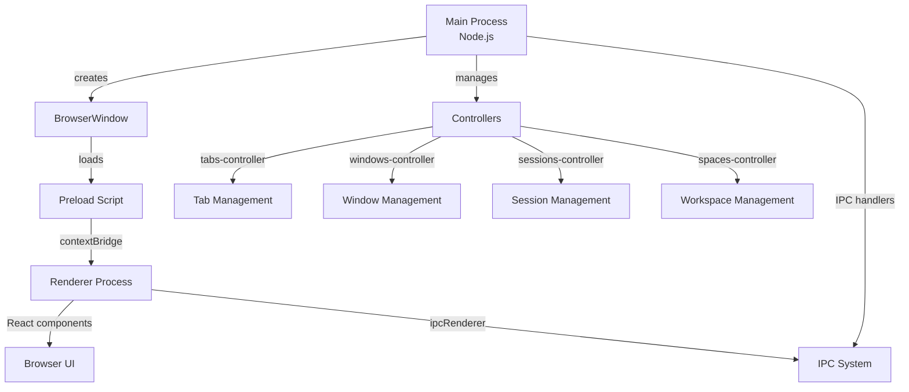

Flow Browser is a privacy-focused web browser built on **Electron**, leveraging a multi-process architecture with separate main and renderer processes communicating via IPC (Inter-Process Communication).

## Core Architecture

Flow Browser follows Electron's standard architecture pattern with these key components:

<CardGroup cols={2}>
  <Card title="Main Process" icon="server" href="/architecture/main-process">
    Node.js environment managing windows, tabs, sessions, and system integration
  </Card>
  <Card title="Renderer Process" icon="browser" href="/architecture/renderer-process">
    React 19 UI with TailwindCSS 4, handling browser chrome and user interface
  </Card>
  <Card title="IPC Communication" icon="arrows-left-right" href="/architecture/ipc">
    Type-safe communication between main and renderer processes
  </Card>
  <Card title="Preload Scripts" icon="shield">
    Secure context bridge exposing controlled APIs to renderer
  </Card>
</CardGroup>

## Technology Stack

### Main Process
- **Runtime**: Node.js 22+ (Electron)
- **Language**: TypeScript
- **Database**: SQLite via better-sqlite3 + Drizzle ORM
- **Build Tool**: electron-vite

### Renderer Process
- **Framework**: React 19
- **Styling**: TailwindCSS 4
- **Animations**: Motion (Framer Motion)
- **Build Tool**: Vite 7
- **State Management**: React hooks + IPC subscriptions

### Preload Layer
- **Context Bridge**: Secure API exposure
- **Type Safety**: Shared TypeScript interfaces
- **Security**: Permission-based API access

## Process Architecture

## Key Directories

<Accordion title="src/main/ - Main Process">
  Node.js backend code:
  - `/controllers/` - Core business logic (tabs, windows, sessions)
  - `/ipc/` - IPC message handlers
  - `/modules/` - Utility modules (extensions, favicons, logging)
  - `/saving/` - Database persistence layer
  - `/app/` - Application lifecycle management

  Entry point: `src/main/index.ts:1`
</Accordion>

<Accordion title="src/renderer/ - Renderer Process">
  React UI code:
  - `/src/routes/` - Page components (main-ui, settings, new-tab)
  - `/src/components/` - Reusable UI components
  - `/src/hooks/` - Custom React hooks
  - `/src/lib/` - Frontend utilities

  Main UI: `src/renderer/src/routes/main-ui/page.tsx:1`
</Accordion>

<Accordion title="src/preload/ - Preload Scripts">
  Security bridge:
  - `index.ts` - Main preload exposing Flow API
  - `webauthn/` - Passkey/WebAuthn support

  Entry point: `src/preload/index.ts:1`
</Accordion>

<Accordion title="src/shared/ - Shared Code">
  Code shared between processes:
  - `/flow/interfaces/` - TypeScript API definitions
  - `/types/` - Shared type definitions
  - `flow.ts` - Global Flow API type declaration

  Types: `src/shared/flow/flow.ts:1`
</Accordion>

## Controller Pattern

Flow Browser uses a **controller-based architecture** in the main process. Each controller is a singleton managing a specific domain:

| Controller | Responsibility | File |
|------------|----------------|------|
| `tabsController` | Tab lifecycle, state, grouping | `src/main/controllers/tabs-controller/index.ts:45` |
| `windowsController` | Window creation, focus, state | `src/main/controllers/windows-controller/index.ts:22` |
| `sessionsController` | Electron sessions, profiles | `src/main/controllers/sessions-controller/index.ts:10` |
| `spacesController` | Workspace/space management | `src/main/controllers/spaces-controller/index.ts` |
| `profilesController` | User profile data | `src/main/controllers/profiles-controller/index.ts` |

<Note>
Controllers are initialized on app startup via `src/main/controllers/index.ts` with careful dependency ordering.
</Note>

## Data Flow Example

Here's how creating a new tab flows through the architecture:

1. **User clicks "New Tab" in UI** (renderer process)
2. **React component calls** `flow.tabs.newTab(url)` via preload API
3. **IPC message sent** from renderer to main process
4. **IPC handler receives** message at `src/main/ipc/browser/tabs.ts`
5. **Handler calls** `tabsController.createTab()`
6. **Tab instance created**, WebContentsView attached to window
7. **State persisted** to SQLite database
8. **IPC event emitted** back to renderer with updated tab data
9. **React UI updates** via `flow.tabs.onDataUpdated()` subscription

## Security Model

<Warning>
Flow Browser implements strict security boundaries:
- Renderer processes have **no direct Node.js access**
- All APIs exposed via **contextBridge** in preload
- Permission system controls which pages can access which APIs
- WebContentsViews run in isolated contexts per profile
</Warning>

Permission levels (see `src/preload/index.ts:58`):
- `all` - Available to all pages
- `app` - Internal app pages only (`flow:` protocol)
- `browser` - Browser UI components only
- `session` - Session/profile management pages
- `settings` - Settings window only

## Extension Support

Flow Browser supports Chrome extensions via:
- **electron-chrome-extensions** - Extension runtime
- **electron-chrome-web-store** - Web store integration
- Extensions run in profile-specific sessions
- Extension APIs exposed through main process

See `src/main/modules/extensions/main.ts` for implementation.

## Database Architecture

Flow uses an embedded SQLite database:
- **ORM**: Drizzle ORM with better-sqlite3
- **Schema**: `src/main/saving/db/schema.ts`
- **Persistence**: Tabs, spaces, profiles, settings
- **Flush Strategy**: Dirty tabs written every ~2s

<Tip>
The database is closed during app quit to prevent corruption. All persistence and IPC operations are skipped when `quitController.isQuitting` is true.
</Tip>

## Next Steps

<CardGroup cols={2}>
  <Card title="Main Process" icon="server" href="/architecture/main-process">
    Deep dive into controllers, lifecycle, and business logic
  </Card>
  <Card title="Renderer Process" icon="browser" href="/architecture/renderer-process">
    Learn about the React UI architecture and component structure
  </Card>
  <Card title="IPC Communication" icon="arrows-left-right" href="/architecture/ipc">
    Understand the type-safe IPC messaging system
  </Card>
</CardGroup>
